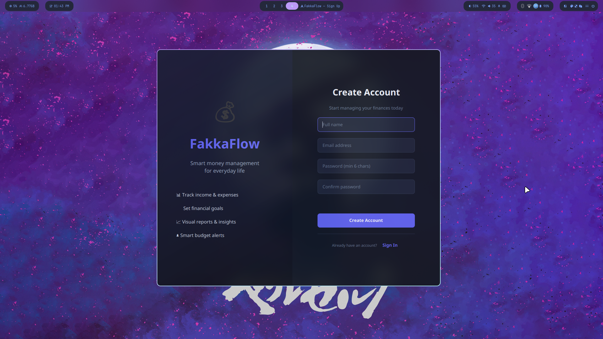
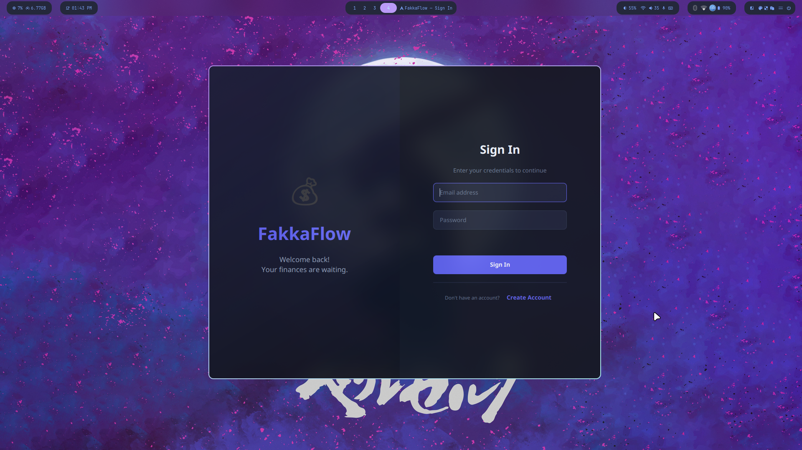
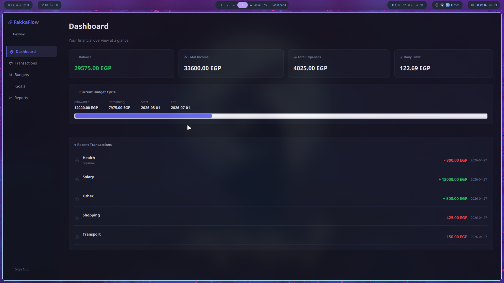
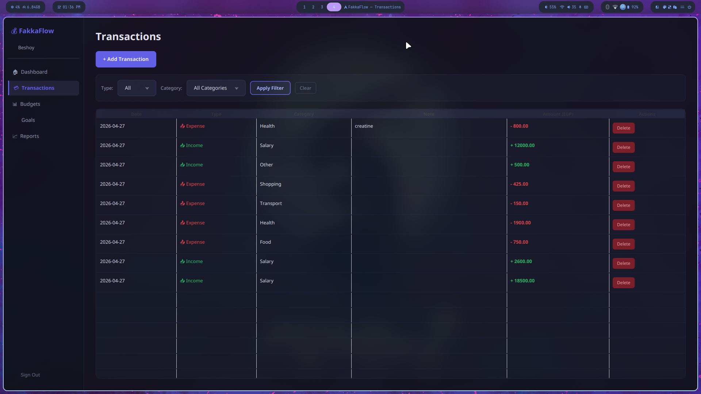
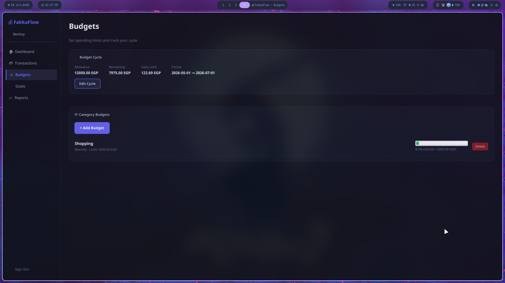
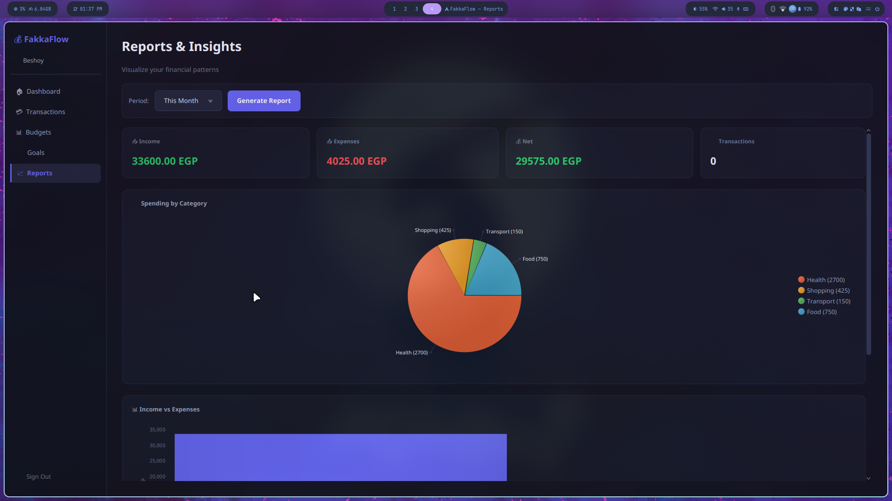
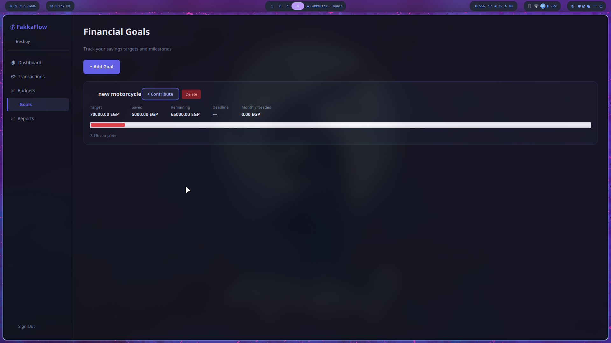

<div align="center">

# 💰 FakkaFlow

**A personal budgeting desktop app built in Java with JavaFX**


A full-featured desktop budgeting app with **expense tracking**, **budget alerts**, **financial goals**, and **visual reports** — built on JavaFX with a dark UI theme and SQLite local storage.

</div>

---

## 🖼️ Showcase

| Sign Up | Login |
|--------|-------|
|  |  |

| Dashboard | Transactions |
|-----------|-------------|
|  |  |

| Budget Management | Financial Reports |
|------------------|-----------------|
|  |  |

| Financial Goals |
|----------------|
|  |

---

## 📄 About

FakkaFlow is a desktop personal budgeting application developed as part of **CS251 — Introduction to Software Engineering** at Cairo University FCAI. The app was designed and implemented entirely by **Beshoy Fomail**, following a full Software Design Specification (SDS) document covering architecture diagrams, class diagrams, sequence diagrams, SOLID principles, and design patterns.

The goal was to build a real, working budgeting tool — not just a prototype. Every screen, every service, every SQL query, and the full dark UI theme was written from scratch. The app stores all data locally in a SQLite database with no internet connection required after the initial Maven dependency download.

📄 **[Software Design Specification (SDS)](screenshots/fakkaflowSSR.pdf)**

---

## ✨ Features

### Authentication
- **Sign Up** with name, email, and password — BCrypt hashed before storing, never plain text
- **Login** with email and password — session created on success, clear error on failure
- Input validation on all fields (email format, password length, empty fields)

### Transactions
- Log **income** or **expense** with amount, category, and optional note
- View all transactions in a sortable table
- **Filter** by type (income/expense) and category
- Delete any transaction instantly

### Budgets
- Set up a **budget cycle** — total allowance, start date, end date
- Add **per-category spending limits** (e.g. Food: 1000 EGP/month)
- Live **progress bars** per category — turn yellow at 80%, red at 100%
- **Budget alerts** shown on both the Budget and Dashboard screens

### Financial Goals
- Create a **savings goal** with name, target amount, deadline, and initial saved amount
- Add **contributions** over time
- Auto-calculates **monthly savings needed** to hit the deadline
- Progress bar per goal

### Reports
- **Pie chart** — spending broken down by category
- **Bar chart** — monthly income vs expenses side by side
- **Auto insights** — top spending category, average spend per category
- Filter by **This Month / Last 3 Months / This Year / All Time**

### Dashboard
- Live **balance** card (income − expenses)
- **Daily limit** card (remaining budget ÷ days left in cycle)
- Budget alert badges (yellow/red)
- Last 5 transactions at a glance

---

## 🛠️ Tech Stack

| Layer | Technology |
|-------|-----------|
| Language | Java 17 |
| GUI Framework | JavaFX 21.0.2 |
| Database | SQLite via JDBC 3.45.1 |
| Password Hashing | jBCrypt 0.4 (Blowfish) |
| Build Tool | Maven 3.6+ |
| Styling | Custom CSS dark theme |

---

## 🏛️ Architecture

3-layer architecture matching the SDS design:

```
┌──────────────────────────────────────────┐
│            UI LAYER (JavaFX)             │
│  LoginScreen · SignUpScreen              │
│  DashboardScreen · TransactionScreen     │
│  BudgetScreen · GoalScreen · ReportScreen│
└──────────────────┬───────────────────────┘
                   │
┌──────────────────▼───────────────────────┐
│            LOGIC LAYER                   │
│  AuthService · BudgetService             │
│  GoalService · AlertingService           │
│  ValidationService · SessionManager      │
│  RolloverEngine (Strategy Pattern)       │
└──────────────────┬───────────────────────┘
                   │
┌──────────────────▼───────────────────────┐
│            DATA LAYER                    │
│  SQLiteDatabase · UserRepository         │
│  TransactionRepository · BudgetRepository│
│  CycleRepository · GoalRepository        │
│  Models: User · Transaction · Budget ... │
└──────────────────────────────────────────┘
                   │
             fakkaflow.db
```

---

## 📁 Project Structure

```
fakkaflow/
├── pom.xml                                   ← Maven: deps, Java version, build plugins
├── README.md
├── screenshots/                              ← App screenshots + SDS document
│   └── fakkaflowSSR.pdf                      ← Full Software Design Specification
│
└── src/main/
    ├── resources/
    │   └── styles.css                        ← Full dark theme stylesheet
    │
    └── java/com/fakkaflow/
        ├── MainApp.java                      ← JavaFX entry point, DB init, first scene
        │
        ├── data/
        │   ├── model/
        │   │   ├── User.java
        │   │   ├── Transaction.java
        │   │   ├── Category.java
        │   │   ├── Budget.java
        │   │   ├── BudgetCycle.java
        │   │   └── Goal.java
        │   │
        │   └── repository/
        │       ├── SQLiteDatabase.java       ← Singleton connection, schema init, raw SQL
        │       ├── UserRepository.java
        │       ├── TransactionRepository.java
        │       ├── CategoryRepository.java
        │       ├── BudgetRepository.java
        │       ├── CycleRepository.java
        │       └── GoalRepository.java
        │
        ├── logic/
        │   ├── service/
        │   │   ├── AuthService.java          ← registerUser(), loginUser()
        │   │   ├── ValidationService.java
        │   │   ├── SessionManager.java       ← Singleton session holder
        │   │   ├── BudgetService.java        ← Daily limit, remaining balance calculations
        │   │   ├── AlertingService.java      ← WARNING ≥80% · EXCEEDED ≥100%
        │   │   └── GoalService.java
        │   │
        │   └── engine/
        │       └── RolloverEngine.java       ← Strategy Pattern: leftover budget logic
        │
        └── ui/
            ├── util/
            │   ├── SceneManager.java         ← Singleton stage holder, navigateTo()
            │   └── UIFactory.java            ← Reusable styled controls factory
            │
            └── view/
                ├── LoginScreen.java
                ├── SignUpScreen.java
                ├── SideNav.java
                ├── DashboardScreen.java
                ├── TransactionScreen.java
                ├── BudgetScreen.java
                ├── GoalScreen.java
                └── ReportScreen.java
```

---

## 🎨 Design Patterns & SOLID

### Strategy Pattern — `RolloverEngine`

```
BudgetService (Context)
    └── delegates to → RolloverEngine (Concrete Strategy)

Swappable without touching BudgetService:
    ├── NoRolloverStrategy       → reset to zero each cycle
    ├── StandardRolloverStrategy → carry full remainder forward
    └── SmartRolloverStrategy    → redistribute by category history
```

### SOLID Principles

| Principle | How it's applied |
|-----------|-----------------|
| **S** Single Responsibility | Each class has one job — `AlertingService` only checks thresholds, `TransactionRepository` only does SQL |
| **O** Open/Closed | New rollover strategies extend `RolloverEngine` without modifying `BudgetService` |
| **I** Interface Segregation | `ILoginView` and `IDashboardView` expose only what each screen needs |
| **D** Dependency Inversion | Controllers depend on repositories, never directly on `SQLiteDatabase` |

---

## 🗄️ Database Schema

`fakkaflow.db` is created automatically on first run — no setup needed.

```sql
users         → id, name, email, password_hash, created_at
categories    → id, name  (seeded: Food · Transport · Shopping · Health · Entertainment · Utilities · Salary · Other)
transactions  → id, user_id, amount, type, category_id, note, timestamp
budget_cycles → id, user_id, total_allowance, start_date, end_date
budgets       → id, user_id, category_id, amount_limit, period
goals         → id, user_id, name, target_amount, saved_amount, deadline, created_at
```

---

## ✅ Prerequisites

| Tool | Version |
|------|---------|
| Java JDK | 17+ |
| Maven | 3.6+ |

**Arch / EndeavourOS:**
```bash
sudo pacman -S jdk17-openjdk maven
```

<details>
<summary>Other operating systems</summary>

**Ubuntu / Debian:**
```bash
sudo apt install openjdk-17-jdk maven
```

**macOS:**
```bash
brew install openjdk@17 maven
```

**Windows:**
- JDK 17: https://adoptium.net
- Maven: https://maven.apache.org/download.cgi
- Add both `bin/` folders to your `PATH`

</details>

---

## 🚀 Installation & Running

```bash
# Clone the repo
git clone https://github.com/beshoy-13/fakkaflow.git
cd fakkaflow

# First run — downloads dependencies (~30MB, one time only)
mvn javafx:run

# Every run after — instant
mvn javafx:run
```

`fakkaflow.db` is created automatically in the working directory on first launch.

### Running from an IDE

**IntelliJ IDEA:**
1. File → Open → select the `fakkaflow/` folder
2. IntelliJ auto-detects Maven — wait for indexing
3. Open `MainApp.java` → click ▶

**Eclipse:**
1. File → Import → Maven → Existing Maven Projects
2. Right-click `MainApp.java` → Run As → Java Application

---

## 🧪 Testing Tips

**Load your account with test money instantly:**
> Transactions → **+ Add Transaction** → Type: `income` → Amount: `999999` → Category: `Salary` → Save

**Trigger a budget alert step by step:**
1. Budgets → Setup Cycle → allowance `5000 EGP`
2. Add Category Budget → Food → limit `200 EGP`
3. Add expense → Food → `180 EGP` → yellow warning appears
4. Add another Food expense → `30 EGP` → turns red (exceeded)

**Inspect the database directly:**
```bash
sqlite3 fakkaflow.db "SELECT id, name, email FROM users;"
```

---

## 👤 Author

**Beshoy Fomail**

[](https://github.com/beshoy-13)
[](https://www.linkedin.com/in/beshoy-fomail)
[](mailto:beshoy.f.labib@outlook.com)

---

<div align="center">

*CS251 — Introduction to Software Engineering · Cairo University FCAI · 2026*

</div>
